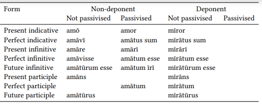
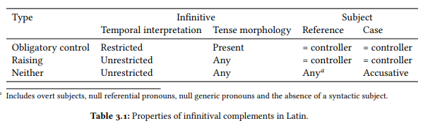

licet illis [_ incolumnibus discedere]

andromenes dixit [se ciceronem uidisse]

[ad hos opprimendos] proficiscitur

**Left Edge Fronting - Danckaert (2012)**

[argentum [si quis dederit]] ultro ibit nuptum

quae saepe mecum mentionem fecerat [puerum aut puellam alicunde [ut reperirem sibi]]

me orabat ut properarem arcessere hanc huc ad me uicinam meam [liberae aedes [ut sibi essent [casinam] quo deducerent]]] 

senex est quidam qui <illam> mandauit mihi [ut emerem ad istanc faciem]

hanc fidem <sibi> me obsecrauit qui se sciet non deserturum [ut darem]

**De topic**

<de philotimo>, faciam equidem ut mones
<de antonio> iam antea tibi scripsi non esse eum a me conuentum
et <de damnatione> feruenter loqui est coeptum
sed quod <de fratre> ubi eum uisuri essemus nesciebamus

[saxa [inter et alia loca periculosa]]
[suorum [in terrore ac fuga]]
[reliquis [ex omnibus partibus]]
[compluribus aliis [de causis]]

cum paucis conlocuti clientibus suis

caesar exercitum reduxit et in hibernis conlocauit

es bibe animo opsequere mecum

[hanc [si nostri transirent]] hostes exspectabant

SUBJECT AGREEMENT

quam pridem pater mihi et mater mortui essent
domus uxor liberi inuenti inuito patre
ibi orgetorigis filia atque unus e filiis captus est

ita res est · fateor. peccatum a me maximest

fratris me quidem pudet pigetque
[non dedisse] istum pudet · me [quia non accepi] piget
nimio id quod pudet facilius fertur quam illud quod piget

ei mihi. non te haec pudent
ita nunc pudeo atque ita nunc paueo atque ita irridiculo sumus ambo

non licet mihi dicere
studiis autem eorum ceteris commondandi fauetur

*Passive*

pugnatur uni tempore omnibus locis
pugnatum est ab utrisque acriter
quor es ausus subigitare alienam uxorem impudens / ita me di ament ultro uentum est ad me
uenitur in eum locum [quem caesar delegit]

eum libellum caesari dedi
datur mi epistula a sororis tuae filio

et tibi ego misi mulierem
meus gnatus med ad te misit

nam illi faueo uirgini

ego uideor stultus
me uideri stultum

altero te occisurum ait <altero uilicum> hodie

omnes uidentur scire
ego uolo ire

ego te non noui neque nouisse adeo uolo
di me perdant si ego tui quicquam apstuli niue adeo apstulisse uellem

mihi istaec uidetur praeda praedatum irier
sol excidisse mihi e mundo uidetur

aequom uidetur tibi ut ego alienum quod est meum esse dicam

miles quom huc adueniat te uolo me amplexari
omnium primum [iste [qui sit sosia]] hoc dici uolo

[senatus consultum] non mihi uidetur esse ualiturum
si non faciat eum aduersus rem publicam facturum uideri
uix uidetur continere lacrimas

cum cogar [exire de naui]

nunc licet mi [libere quiduis loqui]
sed non licet [me isto tanto bono <iudices> uti] · non licet
licetne <opsecro> [bitere] an non licet

hercle uero serio [quamquam ego tibi uideor [stultus]] gaudere aliqui me uolo
heus tu [quamquam nos uidemur tibi [plebeii et pauperes]] ...

ego quoque uolo [esse liber]
[molesta ei esse] nolo
[quam [si ad me perscripseris]] intelleges me neque [diligentiorem esse] uoluisse quam tu esses neque neglegentiorem fore quam tu uelis

uti et uiatores [etiam inuitos consistere] cogant et
neu quis [inuitus sacramentum dicere] cogatur
licere illis [incolumnibus per se ex hibernis discedere]

ait [uenisse illum in somnis ad se mortuom]
hospitium te aiunt quaeritare
is ait [se mihi allaturum cum argento marsuppium]
postquam audierat [non datum iri filio uxorem suo]
cras mane argentum mihi miles dare se dixit
credo [te facile impetrassere]

ne [te indotatam] dicas
et ego impetrare dico id quod petis
at iam faciam ut uerum dicas dicere
ego me dixi erum adducturum et me domi praesto fore
aio te aiacida romanos uincere posse

gaudeo tibi consilium probari meum
negas nouisse me
apparet seruom hunc esse domini pauperis miserique
quid [me amare] refert nisi sim doctus ac dicaculus
[mori me] satiust
haec autem opinatio est iudicatio [se scire quod nesciat]
[rem te ualde bene gessisse] rumor erat
uera dico
nec causam liceat dicere mi
nam quod egomet solus feci id quidem hodie numquam poterit dicere
haec sic dicam erae

qui se diceret eum in appia cognosse
domitium autem aiunt re audita et eos qui una essent se tradidisse
publium ualerium negat habere quicquam deiotarus rex eumque ait a se sustentari
iam hic credo eum adfuturum

adhuc archylis quae adsolent quaeque oportent signa esse ad salutem omnia huic esse uideo
haec facta ab illo oportebant syre
in nostra acie castor et pollux ex equis pugnare uisi sunt
non uideor uidisse postis pulchriores
uix hoc uidemur credere
non mihi uidetur ad beate uiuendum satis posse uirtutem
dictum mihi est hippodamum ad te profectum esse
qui inuentor olei esse dicitur
quae inesse in homine perspiciantur ab iis qui
quae ab aliquo dicta sunt fore
equidem scio iam filius quod amet meus istanc meretricem e proxumo philaenium
sed accidit perincommodo quod eum nusquam uidisti
at nemo dubitat quin subsidio uenturus sit
accidit ut esset luna plena
fac modo ut uenias
hodie uxorem ducas <ut dixi> uolo
timeo [ne aliud credam atque aliud nunties]
peto a te [ut id a me neue in hoc reo neue in aliis requiras]
eum roga [ut relinquat alias res et huc ueniat]
scapha id tu mihi ne suadeas [ut illum minoris pendam]
oratus sum [ad eam [ut irem]]
[mane [ut peteret]] rogaui
ecce apollo mihi ex oraclo imperat [ut ego illic oculos exuram lampadibus ardentibus]
tecum oro et quaeso qui has tabellas afferet tibi ut ei detur quam istic emi uirginem et aurum et uestem

clamabat ille miser [se ciuem esse romanum municipem consanum]
clamare coeperunt [sibi ut haberet hereditatem]

dic [conuenisse egisse te de nuptiis]
dic callicli [me ut conuenat]

quid dicam nescio
scio quid dictura es
nunc quoius iussu uenio et quam ob rem uenerim dicam
rogant me serui quo eam
flaccus quid alii postea facturi essent scire non poterat quid fecissent uidebat
quin iam prius quam sum elocutus scis [si mentiri uolo]
iam scibo [utrum haec me mage amet an marsuppium]
dixit placere sibi
dicebam pater tibi ne matri consuleres male
respondent bello se et suos tutari posse proinde uti propose suis de finibus exercitus deducerent
tu uel suda uel peri algu uel tu aegrota uel uale

dico med esse atriensem
ego uolo ire
ut ille te uideat uolo
nunc ego te facere hoc uolo
!uolo me placere philolachi
!atque ego me id facere studeo uolo amari a meis uolo me patris mei similem

<nam> illi itidem ulixem <audiui> [ut ego sum] fuisse et audacem et malum

**sub uesperum** <caesar> portas claudi militesque ex oppido exire <iussit>.

quamquam quid ego de lictoribus qui paene [ex italia decedere] sim issus

quid uos hanc miseram ac tenuem sectamini praedam quibus licet [iam esse fortunatissimos]

quodsi ciui romano licet [esse gaditanum] siue exsilio siue postliminio siue reiectione huius ciuitatis

**saturnalibus mane** se mihi pindenissitae dediderunt

his mandauit [ut quae diceret ariouistus cognoscerent et ad se referrent]

quae res se sic habet

ecquis has aperit foris

aperitur foris

ualuae subito se ipsae aperuerunt 

[**hoc idem** <caesar> facere] cogebatur [ut [submissis in eundem locum cohortibus] defessos reciperet]

[quo cognito] se in portum recipit

mira sunt nisi inuitauit sese in cena plusculum

neptunus magnis poculis hac nocte eum inuitauit

sic sapientia semper eo contenta est quod adest neque eam umquam sui paenitet

qui cum interemisset clitum familiarem suum uix a se manus abstinuit

me secum in hispaniam ducit

quis autem est tanta quidem de re quin uarie secum ipse disputet

omnis suos caros habet me quidem se ipso cariorem

me ad se ad prandium ad cenam uocant

uehementerque tua sui memoria delectatur

nam ad me misit antonius exemplum caesaris ad se litterarum

quamquam uidebatur [se non grauiter habere] tamen sum sollicitus

qui hic potest [se gerere non perdite]

neque nunc [tam pro se quam contra me laborare] dicitur

ut adulescentuli uobis placere studeant potius quam sibi

quintus misit filium non solum sui deprecatorem sed etiam accusatorem mei

perrumpere nituntur seque ipsi adhortantur ne tantam fortunam ex manibus dimittant

itaque inter se commutant uestem et nomina

ualent pueri et nos et inter se amant
sunt hic inter se quos nunc credo dicere

nunc eam uolt suae matri et patris quibus nata est reddere ultro

meus mihi suos quoique est carus

eum necabam ilico per cerebrum pinna sua sibi quasi turturem

is mi se locum dixit dare
p107

narrabit seruom hinc sese a foribus sosiam amouisse
camillus mihi scripsit te secum locutum
orat ut eam det sibi
qui etiam a me petierit ut secum et apud se essem cotidie

princepsque decima legio per tribunos militium ei gratias egit quod de se optimum iudicium fecisset seque esse ad bellum gerendum paratissimam confirmauit

indutiomarum ad se cum CC obsidibus uenire iussit

iussitque mihi nuntiari mox se uenturum

quod ais illum ad te scribere me sibi nullas litteras remittere

quid est quod hermogenes mihi clodius andromenem sibi dixisse se ciceronem uidisse corcyrae

ubi eum castris se tenere caesar intellexit

lepta me rogat ut [si quid sibi opus sit] accurram

eique est pollicitus si praemium sibi proposuisset se ut clam uenisset sic clam in pyrrhi castra rediturum et eum ueneno necaturum

dicit capram quam dederam seruandam sibi suae uxoris dotem ambedisse oppido

caesar duabus de causis rhenum transire constituit quarum una erat quod auxilia contra se treueris miserant

milesios nauem poposcit quae eum praesidii causa myndum prosequerentur

ei [qui sibi ex lege praetor successerat] exercitum non tradidit

aratoris interest ita se frumenta habere ut decumae quam plurimo uenire possint
caesare ualde liberaliter inuitor in legationem illam [[sibi] ut sim legatus]
.....
ait [se nihil contra dicere] sed [illos putare [talenta CC se debere]] ea [se uelle accipere] [debere autem illos paulo minus]
atque [eum loqui <quidam αυθεντικῶς narrabat> cn carbonis m bruti se poenas persequi] nihil curionem se duce facere quod non joc sulla duce fecisset
statim quaero ex acasto. ille et [tibi et sibi uisum] et [ita se domi ex tuis audisse] [ut nihil esset incommodi]
ut si medicus [cum aegrotus alii medico traditus sit] irasci uelit ei medico [qui sibi successerit] [si [quae ipse in curando constituerit] immutet ille]
pater adlegauit uilicum [qui posceret sibi istanc uxorem]
eum fecisse <aiunt> [sibi [quod faciundum fuit]]

epistulamque ad me attulit missam sibi a caesare

ipsi hi quidem mihi dant uiam quo pacto ab se argentum auferam

reppulit mi manum neque enim dare sibi sauium me siuit
qui si passus esset nos secum loqui

ibo ut [[erus [quod imperauit] alcumenae nuntiem
postero die petreius occulte ad exploranda loca proficiscitur
nostra ilico it uisere ad eam
ut eat uisura sororem
subsidio suis ierunt
ea [[lauatum] dum it] seruandum mihi dedit

deos atque amicos iit salutatum ad forum
quin tradit huc cruminam pressatum umerum
coctum ego non uapulatum dudum conductus fui

sicine oportet ire amicos homini amanti operam datum
oratum ierunt deam ut sibi esset propitia
galliae legati ad caesarem gratulatum conuenerunt

sine me hoc exorare abs te ut istuc delictum desistas tanto opere ire oppugnatum
nequem enim decet sine meo periclo ire aliena ereptum bona
coctum ego non uapulatum dudum conductus fui

quandoquidem ipsus perditum se it secreto hercle equidem eum adiutabo

nam quoi paratum est quod edit nostra gratia nimia est stultitia sessum impransum incedere

stultitiast pater uenatum ducere inuitas canes

quia uenimus coctum ad nuptias
tune es qui hau multo prius abiisti hinc erum accersitum
per dionysia mater pompam me spectatum duxit

daturne illa pamphilo hodie nuptum
ut detur nuptum nostro uilico potius quam illi seruo nequam des

dominus me boues mercatum eretriam misit
ubi domi metues malum fugito huc ad me
sed quaeso quam ob rem nunc epidamnum uenimus an quasi mare omnis circumimus insulas? fratrem quaesitum geminum germanum meum
nunc quam rem oratum huc ueni primum proloquar
hic illest parasitus quem arcessitum missa sum
dominus me boues mercatum eretriam misit

sed ut philosophi ambulant has tibi redditum iri putabam prius

in mea uita tu tibi laudem is quaesitum scelus
soror si mea esses qui magis potueritis mi honorem ire habitum nescio

militis parasitus modo uenerat aurum petere hinc
reddere hoc non perdere erus me misit
era atque haec dolum ex proxumo hunc protulerunt ego hunc missa sum ludere
recurre petere re recenti
nunc hinc parasitum in cariam misi meum petitum argentum a meo sodali mutuom
minime nam parasitum misi nudiusquartus cariam petere argentum is hodie hic aderit

illic hanc mihi seruandam dedit
dedit mihi epistulam legendam tuam
quae mihi defendenda tradita est
singulaque latera castrorum singulis attribuit legionibus munienda
me aliquanto ante librum L. Cossinio ad te perferendum dedisse
caedundum conduxi ego illum
ut ipse in cohortandis militibus pronuntiauerat
ilicet pariter hos perire amando uideo uterque insaniunt
abiendi nunc tibi etiam occasiost
caesari omnia uno tempore erant agenda
ut spatium pila in hostes coiciendi non daretur

Such lack of agreement is attested in all nd-form-constructions but it is only a common alternative
in the constructions shown in (61b) and (61c), and it is favoured when features clash in coordination
or with certain types of neuter or plural logical objects (Miller 2000)

ipse pro castris fortissime pugnans occiditur
illic hanc mihi seruandam dedit
ita populus romanus consuli potius crasso quam priuato africano bellum gerendum dedit
nam sertorianum bellum a senatu priuato datum est

[scyphos [quos utendos dedi philodamo]] rettulitne
inauris da mihi faciendas
et confirmandorum militum causa diripiendas his ciuitates dedit
ibi nunc statuam uolt dare auream solidam faciundam ex auro philippo
si hercle ego te non elinguandam dedero usque ab radicibus impero auctorque ego sum ut tu me cuiuis castrandum loces

nauesque triremes duas quas brundisii faciendas curauerat

atque eum in thurinum ad sollicitandos pastores praemisit
ad denegandum ut celeri lingua utamini
quaedam loca eadem alia ad serendum idonea
nimis doctus ille est ad male faciendum
ad eorum uoluntatem mihi conciliandam maximo te mihi usui fore uideo
plerasque naues in italiam remittit ad reliquos milites equitesque transportandos
ad hos opprimendos afranius de nocte proficiscitur
is indignari coepit regem ad causam dicendam euocari
ad hominum excitanda studia duas promulgauit
onerarias naues ad reliquas armandas reficiendasque utuntur
quod illa aetas magis ad haec utenda idoneast
ne uacuom esse me nunc ad narrandum credas
quibus ad sequendum impeditis
scipio ad sequendum paratus

sex dies ad eam rem conficiendam spatii postulant

aliquam caesar ad insequendum facultatem haberet

his ego duobus generibus facultatem ad se aere alieno liberandas aut leuandas dedi
profectum item domitium ad occupandam massiliam nauibus actuariis septem
sed cum ego faciam omnia quae facere possim ad me adiuuandum
ad diripiendum militibus concessit
legati quibus hae partes ad defendendum obuenerant

atque aduortendum ad animum adest benignitas
tantum ad narrandum argumentum adest benignitas
ad aquam praebendam commodum adueni domum
ipse cum equitatu antecedit ad castra exploranda cornelia
ut cum lentulus consul ad aperiendum aerarium uenisset ad pecuniamque pompeio ex senatus consulto proferendam

