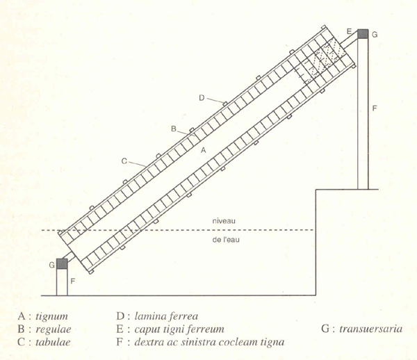

Vitruve, De architectura, 10, 6, 1-4 :

tignum sumitur. 

cuius tigni 
quanta paratur pedum longitudo 
tanta digitorum expeditur crassitudo. 

id ad circinum rotundatur. 

in capitibus circino diuidentur circumitiones eorum 
tetrantibus et octantibus in partes octo
eaeque lineae ita conlocentur ut
plano posito tigno
utriusque capitis ad libellam lineae inter se respondeant
et quam magna pars sit octaua circinationis tigni
tam magna spatia decidantur in longitudinem.

item tigno plano conlocato
lineae ab capite ad alterum caput 
perducantur ad libellam conuenientes. 

sic et in rotundatione et in longitudine aequalia spatia fient. 

ita quo loci describuntur
lineae quae sunt in longitudinem spectantes 
facient decusationes et in decusationibus finita puncta. 

his ita emendate descriptis
sumitur salignea tenuis aut de uitice secta regula
quae uncta liqida pice figitur in primo decusis puncto

deinde traicitur oblique ad insequentes 
longitudinis et circumitionis decusis

item ex ordine progrediens singula puncta praetereundo 
et circum inuoluendo conlocatur in singulis decusationibus
et ita peruenit et figitur ad eam lineam
recedens a primo in octauum punctum
in qua prima pars est eius fixa. 

eo modo quantum progreditur oblique spatium et per octo puncta 
tantundem et longitudine procedit ad octauum punctum. 

eadem ratione per omne spatium longitudinis 
et rotunditatis singulis decusationibus 
oblique fixae regulae per octo crassitudinis diuisiones inuolutos 
faciunt canales et iustam cocleae naturalemque imitationem. 

ita per id uestigium aliae super alias figuntur 
unctae pice liquida
et exaggerantur ad id uti longitudinis octaua pars 
fiat summa crassitudo.

supra eas circumdantur et figuntur tabulae 
quae pertegant eam inuolutionem. 

tunc eae tabulae pice saturantur et lamminis ferreis conligantur
ut ab aquae ui ne dissoluantur in capitibus 
utraque parte habentia transuersaria confixa. 

in his foramina ferrea sunt inclusa inque ea inducuntur styli 

et ita cocleae hominibus calcantibus faciunt uersationes

erectio autem eius ad inclinationem sic erit conlocanda uti
quemadmodum Pythagoricum trigonum orthogonium describitur
sic id habeat responsum
id est uti diuidatur longitudo in partes V
earum trium extollatur caput cocleae 

ita erit ab perpendiculo ad imas naris spatium earum partium IIII…